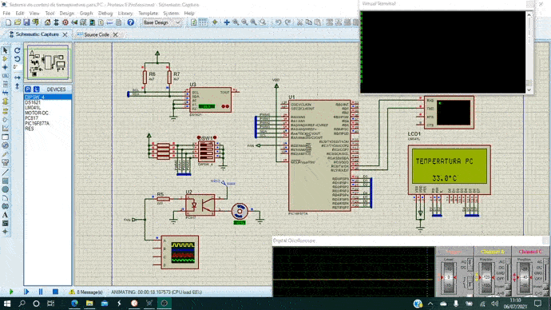

# Sistema de control de temperatura para el ordenador
Este proyecto fue desarrollado en el simulador Proteus version 8.11 utilizando un microcontrolador PIC16F877A, programado con el lenguaje ensamblador y tiene como objetivo regular la temperatura del ordenador por medio de un ventilador.

## Componentes:
* PIC16F877A
* Implementacion de PWM
* Comunicacion USART
* Sensor de temperatura
* LCD 16x4

## Demostración final

